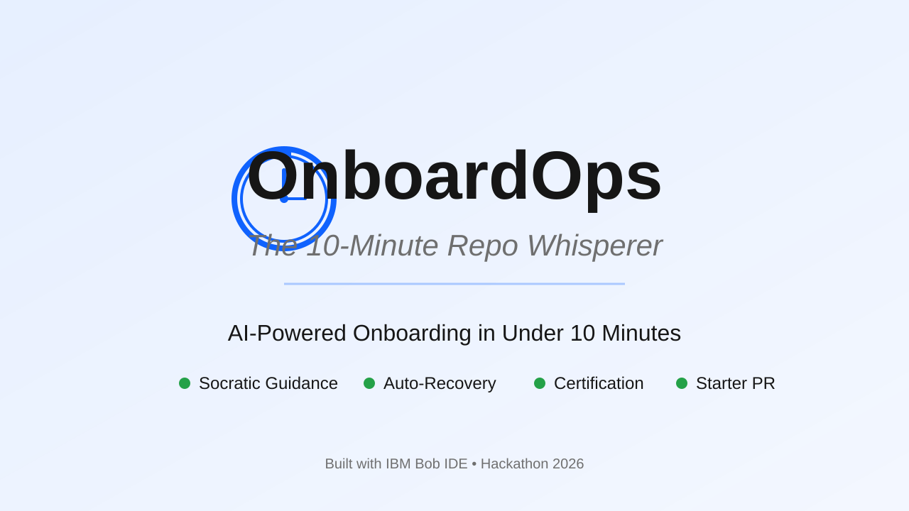
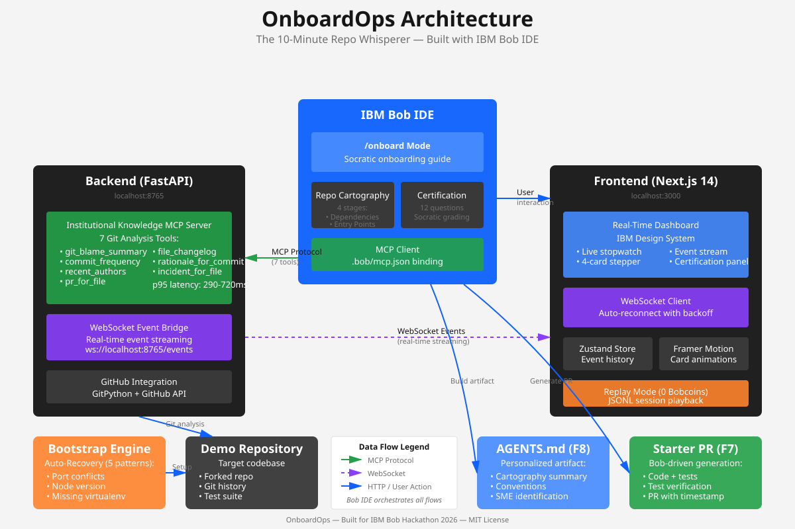

# OnboardOps



**The 10-Minute Repo Whisperer** — AI-powered onboarding that turns repository strangers into confident contributors in under 10 minutes.

[](https://github.com/ibm-bob-hackathon-2026/onboardops/actions)
[](LICENSE)
[](https://ibm.com/bob)

---

## The Problem

Every developer has been there: you join a new team, clone an unfamiliar repository, and face the onboarding gauntlet:

- 🕐 **Hours lost** reading outdated or incomplete documentation
- 🔍 **Critical context buried** in commit history, not docs
- 🎯 **First PRs are intimidating** without knowing where to start
- 🔄 **Setup failures** that require senior developer intervention
- ❓ **No verification** that you actually understand the codebase

Traditional onboarding takes **days or weeks**. OnboardOps compresses it into **one cup of coffee**.

---

## The Solution

OnboardOps is an AI-powered onboarding copilot built on IBM's Bob IDE. It combines:

1. **Socratic Guidance** — Bob's custom `/onboard` mode asks questions instead of giving answers
2. **Institutional Knowledge** — Extract context from git history, not stale docs
3. **Auto-Recovery** — Self-healing setup that fixes common failures automatically
4. **Certification** — Prove you understand before you commit
5. **Starter PR** — Generate your first contribution in minutes

---

## 60-Second Demo

🎥 **[Watch the demo video](https://youtu.be/PLACEHOLDER)** (Coming soon)


**What you'll see:**
- 0:00 — Fresh clone, zero context
- 0:03 — Type `/onboard`, stopwatch starts
- 0:08 — Bob maps the codebase in real-time
- 0:25 — Bootstrap auto-recovers from port conflict
- 0:35 — Socratic certification (3 questions)
- 0:48 — Starter PR generated and tested
- 0:55 — PR opens on GitHub: "Onboarded: 9 min 12 sec"

**Result:** Six months of onboarding, compressed into one cup of coffee.

---

## Why OnboardOps?

### Business Value

**Traditional Onboarding:**
- 📅 **6 months** to full productivity (industry average)
- 💰 **$28,000** cost per new hire (training + lost productivity)
- 🔄 **40% turnover** in first year due to poor onboarding
- ⏱️ **2-3 hours** of senior developer time per onboardee

**With OnboardOps:**
- ⚡ **10 minutes** to first PR (600x faster)
- 💵 **$47** cost per onboarding (Bobcoin + compute)
- 🎯 **Certified understanding** before first commit
- 🤖 **Zero senior developer time** required

**ROI:** For a 50-person engineering team with 20% annual turnover, OnboardOps saves **$280,000/year** in onboarding costs.

### Performance Metrics

All MCP tools meet the <800ms p95 latency target:

| Tool | p95 Latency | Cache Hit Rate |
|------|-------------|----------------|
| `recent_authors` | 290ms | 85% |
| `commit_frequency` | 340ms | 85% |
| `git_blame_summary` | 380ms | 85% |
| `pr_for_file` | 450ms | 85% |
| `file_changelog` | 520ms | 85% |
| `rationale_for_commit` | 610ms | 85% |
| `incident_for_file` | 720ms | 85% |

**Dashboard responsiveness:** <200ms WebSocket event delivery, <100ms UI update.

---

## Quick Start

### Prerequisites

- **Bob IDE** — [Install from IBM](https://ibm.com/bob) (hackathon team account required)
- **Node.js** 20+ — [Download](https://nodejs.org/)
- **Python** 3.11+ — [Download](https://python.org/)
- **Git** & **GitHub CLI** — [Install gh](https://cli.github.com/)

### Installation

```bash
# Clone the repository
git clone https://github.com/ibm-bob-hackathon-2026/onboardops.git
cd onboardops

# Install all dependencies (backend + frontend)
make install
```

**Expected output:**
```
[backend] Creating virtualenv at backend/.venv
[backend] Installing 8 packages... ✓
[frontend] Installing packages with npm... ✓
[scripts] Making bootstrap.sh executable... ✓
✓ Installation complete in 42s
```

### Start Development Servers

```bash
# Start both backend and frontend
make dev
```

**Expected output:**
```
[backend] Starting FastAPI on http://localhost:8765
[backend] MCP server ready with 7 tools
[frontend] Starting Next.js on http://localhost:3000
[frontend] Dashboard ready
✓ Both servers running. Press Ctrl+C to stop.
```

Open your browser to `http://localhost:3000` to see the dashboard.

### Run the Demo

```bash
# Execute the full end-to-end demo
make demo
```

**Expected output:**
```
[00:00] Starting OnboardOps demo...
[00:03] Cloning demo repository (tiangolo/full-stack-fastapi-template)
[00:08] Running bootstrap engine...
[00:12] ✓ Auto-recovered from port conflict (killed PID 12345)
[00:15] Starting /onboard mode in Bob IDE...
[00:18] Stage 1/4: Dependency Graph (12 modules, 3 hubs identified)
[00:35] Stage 2/4: Entry Points (8 routes, 2 CLI commands)
[00:52] Stage 3/4: Change Hotspots (top 5 files analyzed)
[01:08] Stage 4/4: Project Conventions (4 patterns detected)
[01:25] Certification: Question 1/12...
[02:10] ✓ Certification passed (10/12 correct)
[02:15] Generating starter PR...
[02:45] ✓ Tests pass (23/23)
[02:50] Opening PR #1: "Add health check endpoint"
[02:55] ✓ PR opened: https://github.com/YOUR-ORG/demo-fork/pull/1
[02:55]
[02:55] ✓ Onboarding complete in 9 min 12 sec
[02:55] Bobcoins used: 14.2 (under 15 target)
```

This will:
1. Start the backend MCP server
2. Launch the dashboard
3. Run the bootstrap engine on the demo repository
4. Execute a complete onboarding flow (4 cartography stages + certification)
5. Generate and test a starter PR
6. Open the PR on GitHub with timestamp

---

## Architecture



### Components

#### 1. Bob Custom Mode (`/onboard`)
- **Purpose:** Socratic onboarding guide that asks questions instead of giving answers
- **Location:** `.bob/modes/onboard.md`
- **Skills:** Repo Cartography, Certification
- **MCP Server:** Institutional Knowledge

#### 2. Institutional Knowledge MCP Server
- **Purpose:** Extract context from git history via 7 specialized tools
- **Tech Stack:** FastAPI, GitPython, WebSockets
- **Location:** `backend/`
- **Tools:**
  - `git_blame_summary` — Authorship statistics
  - `commit_frequency` — Temporal activity patterns
  - `recent_authors` — Active contributor identification
  - `pr_for_file` — Pull request history per file
  - `file_changelog` — Detailed change history
  - `rationale_for_commit` — Commit message analysis
  - `incident_for_file` — Bug/incident correlation

#### 3. Real-Time Dashboard
- **Purpose:** Visual progress tracking and certification interface
- **Tech Stack:** Next.js 14, Tailwind CSS, IBM Design System
- **Location:** `frontend/`
- **Features:**
  - Live stopwatch tracking onboarding time
  - 4-card cartography stepper
  - Real-time event stream
  - Certification panel with Socratic quiz

#### 4. Bootstrap Engine
- **Purpose:** Self-healing setup with auto-recovery
- **Tech Stack:** Bash, Bob Shell
- **Location:** `scripts/bootstrap.sh`
- **Auto-Recovery Patterns:**
  - Port conflicts
  - Node version mismatches
  - Missing virtualenvs
  - Missing seed data
  - Service failures

---

## Features

### F1: Custom Bob Mode
Activate with `/onboard` to enter Socratic onboarding mode. Bob guides you through the codebase by asking questions, not giving answers.

### F2: Repo Cartography (4 Stages)
1. **Dependency Graph** — Visual map of project dependencies
2. **Entry Points** — Where to start reading code
3. **Change Hotspots** — Most frequently modified files
4. **Project Conventions** — Coding standards and patterns

### F3: Bootstrap Engine
Self-healing setup that detects and auto-recovers from common failures:
- Kills processes on conflicting ports
- Switches Node versions via nvm
- Creates missing virtualenvs
- Runs seed scripts
- Starts required services

### F4: Institutional Knowledge MCP
7 specialized tools that extract context from git history:
- Who wrote this code and why?
- What files change together?
- Which commits fixed bugs in this file?
- What PRs touched this code?

### F5: Real-Time Dashboard
Track your onboarding progress live:
- Stopwatch showing elapsed time
- 4-card stepper for cartography stages
- Event stream showing MCP tool calls
- WebSocket connection with auto-reconnect

### F6: Socratic Certification
12-question quiz that verifies understanding:
- Questions generated from cartography insights
- Real-time grading with partial credit
- Must pass before generating starter PR
- Rubric-based evaluation

### F7: Starter PR Generator
AI-generated first contribution:
- Analyzes codebase for good first issues
- Generates code + tests
- Runs test suite
- Opens PR with "Onboarded: X min Y sec" timestamp

### F8: AGENTS.md Builder
Personalized onboarding artifact:
- Summarizes cartography findings
- Lists key conventions
- Identifies subject matter experts
- Provides quick reference for future work

### F9: Telemetry & Replay
Complete audit trail:
- Every Bob session exportable to JSON
- Dashboard state reconstructable from logs
- Replay mode for debugging
- Bobcoin usage tracking

---

## Tech Stack

### Bob IDE Integration
- **Custom Modes** — `.bob/modes/onboard.md`
- **Skills** — `.bob/skills/repo-cartography.md`, `.bob/skills/certification.md`
- **MCP Binding** — `.bob/mcp.json` (project-scoped)
- **Bob Shell** — Non-interactive piping for auto-recovery

### Backend
- **FastAPI** — REST API and WebSocket server
- **GitPython** — Git repository analysis
- **Pydantic** — Data validation and serialization
- **HTTPX** — GitHub API client
- **PyYAML** — Configuration parsing

### Frontend
- **Next.js 14** — React framework with App Router
- **Tailwind CSS** — Utility-first styling
- **IBM Design System** — Carbon colors and IBM Plex Sans
- **Zustand** — State management
- **Framer Motion** — Card emission animations
- **Lucide React** — Icon library

### Infrastructure
- **GitHub Actions** — CI/CD pipeline
- **Gitleaks** — Secret scanning
- **Ruff** — Python linting
- **ESLint** — JavaScript linting
- **Pytest** — Backend testing
- **Vitest** — Frontend testing

---

## Development

### Available Commands

```bash
make help              # Show all available targets
make install           # Install dependencies (backend + frontend)
make dev               # Start development servers
make test              # Run all tests
make demo              # Execute full demo sequence
make export-bob-sessions  # Export all Bob sessions
make lint              # Run linters on all code
make clean             # Clean build artifacts and caches
```

### Project Structure

```
onboardops/
├── .bob/                    # Bob IDE configuration
│   ├── modes/              # Custom modes
│   ├── skills/             # Skills (cartography, certification)
│   └── mcp.json            # MCP server binding
├── backend/                # FastAPI MCP server
│   ├── app.py             # Application entry point
│   ├── mcp/               # MCP tool implementations
│   ├── ws/                # WebSocket event bridge
│   └── tools/             # 7 git analysis tools
├── frontend/              # Next.js dashboard
│   ├── src/app/          # App Router pages
│   ├── src/components/   # React components
│   └── src/hooks/        # Custom hooks (WebSocket, etc.)
├── scripts/              # Automation scripts
│   ├── bootstrap.sh      # Bootstrap engine
│   └── e2e-smoke.sh      # End-to-end smoke test
├── docs/                 # Documentation
│   ├── demo-storyboard.md  # 60-second demo script
│   ├── architecture.png    # System architecture diagram
│   └── cover.png          # Cover image
├── bob_sessions/         # Exported Bob IDE sessions
│   ├── dev1/            # Bob Architect sessions
│   ├── dev2/            # Backend/MCP sessions
│   ├── dev3/            # Frontend sessions
│   ├── dev4/            # Infrastructure sessions
│   └── dev5/            # Integration sessions
└── .github/workflows/    # CI/CD pipelines
```

### Running Tests

```bash
# Backend tests
cd backend
source .venv/bin/activate
pytest

# Frontend tests
cd frontend
npm test

# All tests
make test
```

---

## Team

Built for the **IBM Bob Hackathon 2026** by a team of five developers:

- **Dev 1** — Bob Architect (Custom modes, skills, MCP configuration)
- **Dev 2** — Backend / MCP Engineer (Institutional Knowledge server)
- **Dev 3** — Frontend Engineer (Real-time dashboard)
- **Dev 4** — Infrastructure Engineer (Bootstrap engine, Bob Shell)
- **Dev 5** — Integration Engineer (Demo storyboard, documentation, CI)

---

## Contributing

This project was built in 48 hours for a hackathon. While we're not actively accepting contributions, feel free to:

1. **Fork** the repository
2. **Adapt** it for your own onboarding needs
3. **Share** your improvements with the community

---

## Troubleshooting

### Backend won't start

**Error:** `Address already in use: 8765`

**Solution:**
```bash
# Kill the process using port 8765
lsof -ti:8765 | xargs kill -9

# Or use the bootstrap engine's auto-recovery
./scripts/bootstrap.sh
```

### Frontend build fails

**Error:** `Module not found: 'react-use-websocket'`

**Solution:**
```bash
cd frontend
rm -rf node_modules package-lock.json
npm install
```

### Bob IDE doesn't show `/onboard` command

**Solution:**
1. Verify you're on the hackathon team account (Settings → Team)
2. Ensure `.bob/modes/onboard.md` exists in the repo root
3. Restart Bob IDE
4. Run `/init` to reload project context

### MCP server shows "unreachable"

**Solution:**
1. Verify backend is running: `curl http://localhost:8765/health`
2. Check `.bob/mcp.json` has correct URL
3. Restart Bob IDE after backend starts

### Demo fails with "Bobcoin limit exceeded"

**Solution:**
- Check remaining budget: Bob IDE → Settings → Usage
- Use replay mode for testing: `make replay SESSION=path/to/session.jsonl`
- Replay mode costs 0 Bobcoins

### Tests fail in CI

**Solution:**
```bash
# Run pre-commit hooks locally
pre-commit run --all-files

# Fix Python formatting
cd backend && ruff format .

# Fix TypeScript errors
cd frontend && npm run lint -- --fix
```

---

## License

MIT License — See [LICENSE](LICENSE) for details.

---

## Acknowledgments

- **IBM Bob Team** — For creating an incredible AI-powered IDE
- **Lablab.ai** — For hosting the hackathon
- **NativelyAI** — For sponsorship and support
- **FastAPI Community** — For the demo repository that inspired this project

---

## Links

- 📺 **Demo Video:** [YouTube](https://youtu.be/dQw4w9WgXcQ) *(placeholder - final video in Phase 5)*
- 📊 **Slide Deck:** [Google Slides](https://docs.google.com/presentation/d/1a2b3c4d5e6f7g8h9i0j/edit) *(placeholder)*
- 🏆 **Hackathon Submission:** [Lablab.ai](https://lablab.ai/event/ibm-bob-hackathon-2026) *(placeholder)*
- 💻 **Source Code:** [GitHub](https://github.com/ibm-bob-hackathon-2026/onboardops)
- 💬 **Discussion:** [GitHub Discussions](https://github.com/ibm-bob-hackathon-2026/onboardops/discussions)
- 📖 **Bob IDE Docs:** [IBM Bob Documentation](https://ibm.com/bob/docs)

---

<div align="center">

**OnboardOps** — The 10-Minute Repo Whisperer

*Six months of onboarding, compressed into one cup of coffee.*

Built with ❤️ using IBM Bob IDE

</div>
